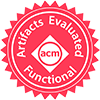

A paper consists of a constellation of artifacts that extend beyond the document itself: software, mechanized proofs, models, test suites, benchmarks, and so on. In some cases, the quality of these artifacts is as important as that of the document itself, but often unrecognized. Sometimes the software tools that accompany the paper take years to build; in many such cases, authors who go to this trouble should be rewarded for setting high standards and creating systems that others in the community can build on.

To address this, PADS has joined the group of ACM conferences that have established an *optional* reviewing process to evaluate artifacts and reproduce computational results. When submitting a contribution, the authors can choose to undergo evaluation, but this process has no effect on the standard paper evaluation process, as the reproducibility process only starts after the paper is accepted.

Goals
-----

The goal of the Artifact Evaluation process are manifold:

* to increase the trust in modeling and simulation research;
* to make artifacts accessible and to prepare them for reuse;
* to foster progress in modeling and simulation science and practice;
* to reward authors who take the trouble to create useful documentation and artifacts beyond the paper.

Criteria
--------

The evaluation criteria are simple. A paper sets up certain expectations of its artifacts based on its content. The Reproducibility Committee (RC) will read the paper and judge how well the artifacts match these criteria. Thus the RC's decision will be that the artifacts do (or do not) "conform to the expectations set by the paper". Ultimately, we expect artifacts to be:

-   permanently available for retrieval;
-   functional;
-   reusable;
-   associated with results that can be reproduced.

Reproducibility Reports
-----------------------

To reward the authors, to increase the visibility of reproduced research, and to show how the initiative is carried out, the proceedings will include a short report citing the original paper and showing the reproduced results, making them available to readers. These reports will be overlooked by the Reproducibility Chairs, ensuring that they are objective and factual, and that no negative results are attached to the original papers in the reports.

Only papers requesting for reproducibility of the research results will be accompanied by a report.

The Badges
----------
In accordance with [ACM Artifact Review and Badging](https://www.acm.org/publications/policies/artifact-review-badging), some of the following ACM badges may be applied, and stamped on the final paper published in the proceedings.

### Artifacts Evaluated --- Functional

{: .image-right }

The artifacts associated with the research are found to be documented, consistent, complete, exercisable, and include appropriate evidence of verification and validation.

- *Documented*: At minimum, an inventory of artifacts is included, and sufficient description provided to enable the artifacts to be exercised.
- *Consistent*: The artifacts are relevant to the associated paper, and contribute in some inherent way to the generation of its main results.
- *Complete*: To the extent possible, all components relevant to the paper in question are included. (Proprietary artifacts need not be included. If they are required to exercise the package then this should be documented, along with instructions on how to obtain them. Proxies for proprietary data should be included so as to demonstrate the analysis.)
- *Exercisable*: *Included scripts and/or software used to generate the results in the associated paper can be successfully executed, and included data can be accessed and appropriately manipulated.

### Artifacts Evaluated --- Reusable

{: .image-right }

The artifacts associated with the paper are of a quality that significantly exceeds minimal functionality. That is, they have all the qualities of the Artifacts Evaluated -- Functional level, but, in addition, they are very carefully documented and well-structured to the extent that reuse and repurposing is facilitated.

### Artifacts Available

{: .image-right }

Authors have created artifacts relevant to this paper have been placed on a publicly accessible archival repository. A DOI or link to this repository along with a unique identifier for the object is provided. **Note that this badge will only be awarded in conjunction with one of the Artifacts Evaluated badges.**

**Notes**: We do not mandate the use of specific repositories. Publisher repositories (such as the ACM Digital Library), institutional repositories, or open repositories (e.g., Zeonodo, figshare or Dryad) are acceptable. In all cases, repositories used to archive data should have a declared plan to enable *permanent accessibility*. Personal web pages are not acceptable for this purpose.

### Results Reproduced

{: .image-right }

This badge is applied to papers in which the main results of the paper have been successfully obtained by a person or team other than the author.

In particular, the main results of the paper have been obtained in a subsequent study by a person or team other than the authors, using, in part, artifacts provided by the author.

Evaluation Process
------------------

At the time of paper submission, the authors can check a checkboxe on the submission page to opt in the initiative. To maintain a wall of separation between paper review and the artifacts, the evaluation process will only start after the corresponding paper is accepter. Of course, they can (and should!) prepare their artifacts well in advance. By no means, the Artifact Evaluation initiative will have an impact on the acceptance of papers, meaning that authors who opt in will not have higher changes of having their work accepted, nor failing at reproducing the results will have an impact on the acceptance of the paper.

Each artifact will be assigned to at least one member of the RC. The artifacts will be evaluated in relation to the expectations set by the paper. If applicable, reviewers may try to tweak provided inputs and create new ones, to test the limits of the proposed system.

Submitted artifacts will undergo a two-phase evaluation:

- *Kicking the tires*: reviewers download, install the artifact (where relevant), and check its integrity. They also look for any possible setup problem that may prevent it from being properly evaluated (e.g., corrupted or missing files, virtual environments do not start, missing dependencies, immediate crashes on the simplest example, etc.). Authors are informed of the outcome of this phase and, in case of technical problems, they can help solve them during a brief author response period.

- *Artifact assessment*: reviewers evaluate the artifacts, checking if they live up to the expectations created by the paper. Since we anticipate possible glitches also in this phase, the RC might get in contact with the authors also during this phase, asking for assistance and or corrections. The evaluated artifact should be considered "final", and for the Artifact Available badge any update should be reflected in the DOI associated with the artifact.

At the end of the process, reviewers will prepare a report (to be published in the proceedings) including a discussion of the artifact evaluation process. These reports will be jointly reviewed by the RC Chairs and the authors of the original paper. Papers with artifacts that "meet expectations" will be stamped with the following ACM badges. More than one badge could be applied to each paper, depending on what expectations on the artifacts are met.

## Artifact Details

To avoid excluding some papers, the RC will try to accept any artifact that authors wish to submit. These can be models, software, mechanized proofs, test suites, data sets, and so on. Obviously, the better the artifact is packaged, the more likely the RC can actually work with it.

Submission of an artifact does not contain tacit permission to make its content public. RC members will be instructed that they may not publicize any part of your artifact during or after completing evaluation, nor retain any part of it after evaluation. Thus, you are free to include models, data files, proprietary binaries, etc. in your artifact. We do strongly encourage that you anonymize any data files that you submit.

## Submission Guidelines for the Artifacts

Please note that the SIGSIM PADS Artifact Evaluation initiative is an open reviewing process in which both reviewers and authors are known to each other. The reviewing will start after the research paper has been accepted. We expect the artifacts to be submitted within one week after the acceptance letter. Within the letter of acceptance, there will be further information on how to submit the material. To support an efficient process, authors should carefully follow the guidelines given below in preparing the supplementary material. The submitted material will be a zip file including at its simplest:

-   A README file, describing the artifacts associated with the paper (e.g., data, simulation models, ...). Please provide detailed information about the required environment in which the artifact(s) can be executed and evaluated.
-   A license file
-   For software, also give instructions on how to resolve dependencies, if required.
-   A script for every figure or table of the paper that contains results that shall be reproduced.

Of course, any additional information that you believe is relevant, shall be included to simplify the reviewing process by the RC.

## Reproducibility Committee

The Reproducibility Committee (RC) consists of mainly graduate students, postdocs, and researchers, identified with the help of the PADS Steering Committee and the Program Committee.

Qualified graduate students are often in a much better position than many researchers to handle the diversity of systems expectations we will encounter. In addition, these graduate students represent the future of the community, so involving them in this process early will help pushing this process forward. However, participation in the RC can provide useful insight into both the value of artifacts, the process of artifact evaluation, and help establishing community norms for artifacts. We therefore seek to include a broad cross-section of the PADS community on the RC.

Of course, the RC will devote considerable attention to both mentoring and monitoring the junior members of the RC, helping to educate the students on their responsibilities and privileges.

| Member         | Affiliation       | Role    |
| :------------- | :---------------- | :------ |
| TBD            | TBD               | Chair   |

